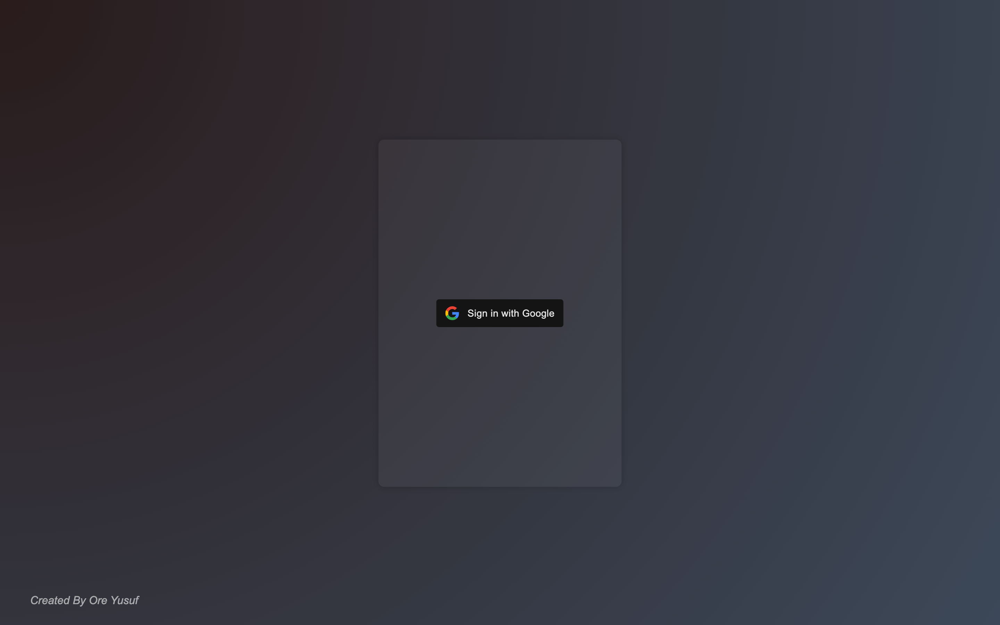
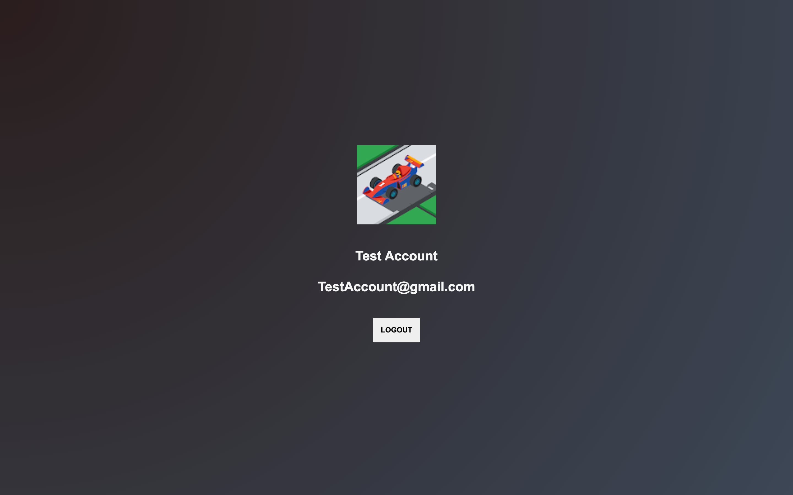

<br />
<div align="center">

  <h3 align="center"> Firebase Auth with React: Email/Password and Google Sign-in </h3>

  <p align="center">
    This guide explores implementing Firebase Authentication in a React app, focusing on Email/Password and Google Sign-in.
    <br />
    <br />
    <a href="https://oreyusuf.co.uk/project/react-template-sign-in-with-google-firebase">View Demo</a>
    ·
    <a href="/issues">Report Bug</a>
  </p>





</div>


<!-- ABOUT THE PROJECT -->
## About The Project

Firebase Authentication streamlines user authentication in web and mobile apps, allowing developers to integrate authentication easily without building complex systems.


### Built With

[![Next][Next.js]][Next-url]
[![React][React.js]][React-url]


<!-- GETTING STARTED -->
## Getting Started

Instructions on setting up project to get a running follow these simple these steps.

#### Instructions

<a href="https://oreyusuf.co.uk/project/react-template-sign-in-with-google-firebase"> View My Article </a>

### Installation

1. Clone the repo
   ```sh
   git clone https://github.com/OreYusuf/Firebase-Auth-with-React-Email-Password-and-Google-Sign-in
   ```
2. Install NPM packages
   ```sh
   npm install
   ```
3. Run the project
   ```bash
   npm run start
   ```


<!-- MARKDOWN LINKS & IMAGES -->
<!-- https://www.markdownguide.org/basic-syntax/#reference-style-links -->
[contributors-shield]: https://img.shields.io/github/contributors/github_username/repo_name.svg?style=for-the-badge
[contributors-url]: https://github.com/github_username/repo_name/graphs/contributors
[forks-shield]: https://img.shields.io/github/forks/github_username/repo_name.svg?style=for-the-badge
[forks-url]: https://github.com/github_username/repo_name/network/members
[stars-shield]: https://img.shields.io/github/stars/github_username/repo_name.svg?style=for-the-badge
[stars-url]: https://github.com/github_username/repo_name/stargazers
[issues-shield]: https://img.shields.io/github/issues/github_username/repo_name.svg?style=for-the-badge
[issues-url]: https://github.com/github_username/repo_name/issues
[license-shield]: https://img.shields.io/github/license/github_username/repo_name.svg?style=for-the-badge
[license-url]: https://github.com/github_username/repo_name/blob/master/LICENSE.txt
[linkedin-shield]: https://img.shields.io/badge/-LinkedIn-black.svg?style=for-the-badge&logo=linkedin&colorB=555
[linkedin-url]: https://linkedin.com/in/linkedin_username
[product-screenshot]: images/screenshot.png
[Next.js]: https://img.shields.io/badge/next.js-000000?style=for-the-badge&logo=nextdotjs&logoColor=white
[Next-url]: https://nextjs.org/
[React.js]: https://img.shields.io/badge/React-20232A?style=for-the-badge&logo=react&logoColor=61DAFB
[React-url]: https://reactjs.org/
[Vue.js]: https://img.shields.io/badge/Vue.js-35495E?style=for-the-badge&logo=vuedotjs&logoColor=4FC08D
[Vue-url]: https://vuejs.org/
[Angular.io]: https://img.shields.io/badge/Angular-DD0031?style=for-the-badge&logo=angular&logoColor=white
[Angular-url]: https://angular.io/
[Svelte.dev]: https://img.shields.io/badge/Svelte-4A4A55?style=for-the-badge&logo=svelte&logoColor=FF3E00
[Svelte-url]: https://svelte.dev/
[Laravel.com]: https://img.shields.io/badge/Laravel-FF2D20?style=for-the-badge&logo=laravel&logoColor=white
[Laravel-url]: https://laravel.com
[Bootstrap.com]: https://img.shields.io/badge/Bootstrap-563D7C?style=for-the-badge&logo=bootstrap&logoColor=white
[Bootstrap-url]: https://getbootstrap.com
[JQuery.com]: https://img.shields.io/badge/jQuery-0769AD?style=for-the-badge&logo=jquery&logoColor=white
[JQuery-url]: https://jquery.com 